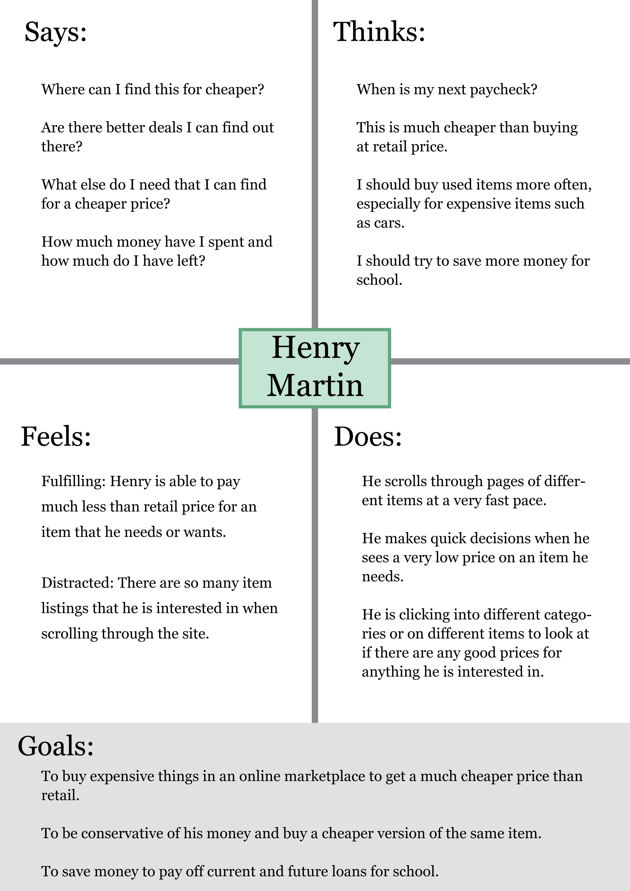
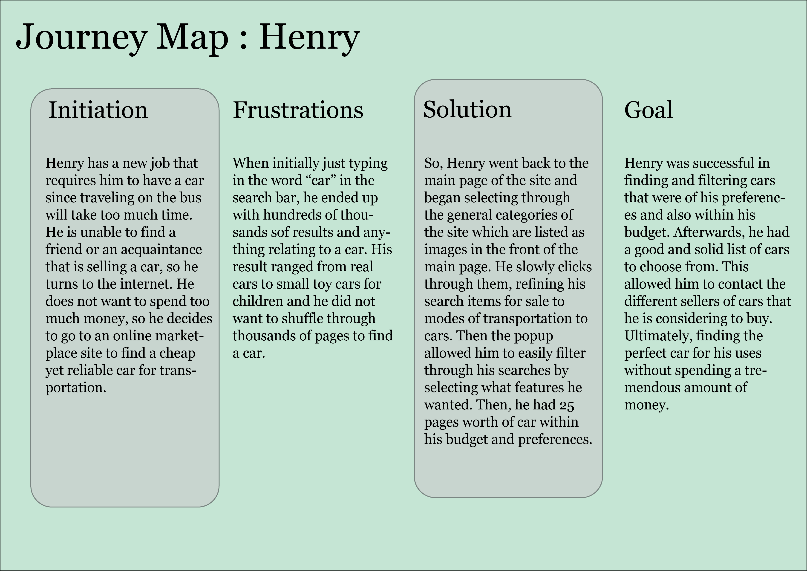
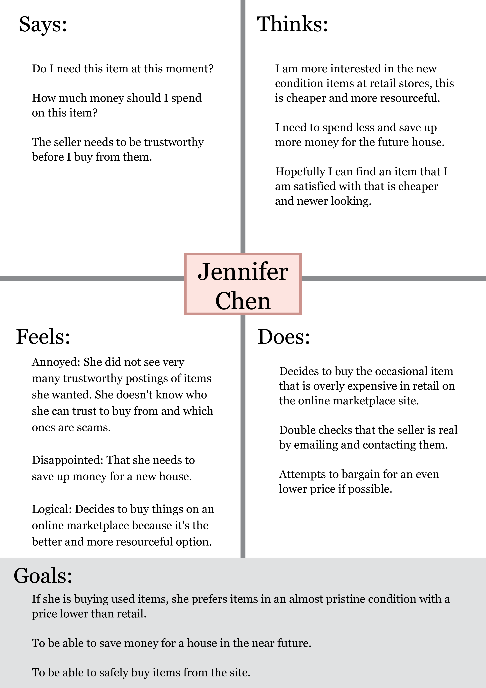
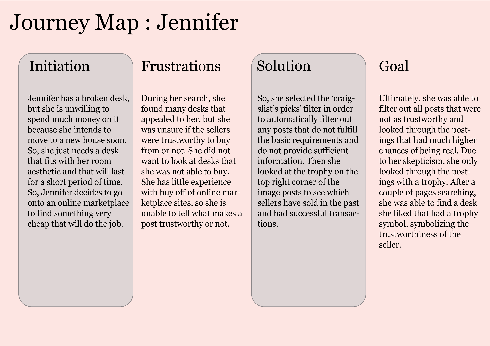
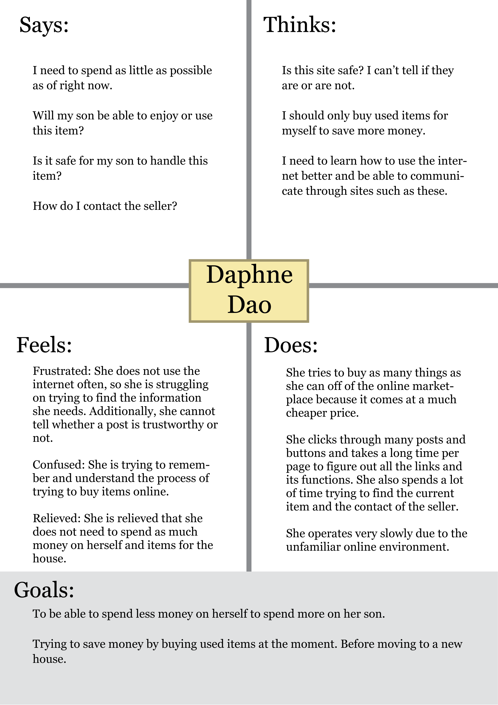
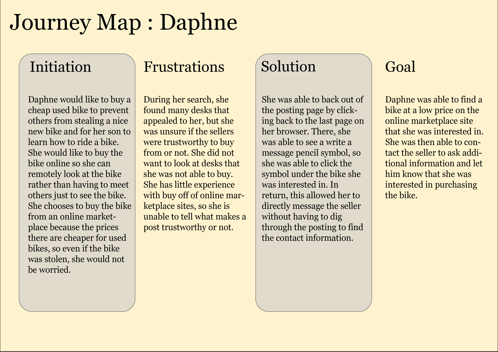

# DH150 Assignment 5

##  UX Storytelling:

The purpose of UX storytelling is to communicate a certain product, design, and story to the audience. To do UX storytelling, the creators must think and work from the users perspective in order to understand their behaviors and motivations. By understanding and testing different users, the creators will be able to create a better product that is better for everyone. Ultimately, UX storytelling must be able to fulfill the users needs and goals and deliver the product’s main focus. 

## Three Features to Improve/Add:

A system that automatically filters posts that either have a seller with a good rating or have filled out all or most of the details of the object they are selling. This will allow new users to know what posts are more trustworthy. 

Improve and create a better categorization of items by using images and better design to help buyers find what they need or want. 

Better interface on the item posting page to allow people to easily find the contact information of the seller. 

## Persona 1:

### Empathy Map:

### Scenario 1:

Henry is a 4th year undergraduate student at University of California, Los Angeles studying business. He currently lives with his 6 roommates in an apartment close to the school. He just got a new higher paying job that is slightly further away and needs a car to get to his new workplace. He would take the bus, but since it is further away than his previous job, it will take double the amount of time to get there due to the constant stops. Getting a car will allow him to save more time and give him more flexibility to travel around Los Angeles. First, Henry asks around to see if anyone he knows is selling a car, but unfortunately, nobody is. So, he goes onto craigslist to search for a cheap used, but reliable car that will get him through the rest of the school year. 

Henry first goes onto the online marketplace site on his laptop and enters in his zipcode to refine the area limit to be within Los Angeles. This way, he does not need to travel far to get the seller. He then searches up the word “car” in the search bar. He ends up wil thousands of results and begins scrolling through all the pages. He then goes back to the main page by clicking the website name on the upper left corner. He then looks at all the categories that are listed in the front page and clicks “for sale”. His webpage moves to a different screen that shows all the categories under ‘for sale’. Henry sees a picture with a vehicle that says “ transportation” underneath the image. He clicks on the image which takes him to another category that displays images of different modes of transportation. He selects the image with a car which brings him to a popup that helps filter the results. In this pop up, Henry checks off the boxes for economic and 4-door and he types in the minimum price as $0 and the maximum price as $5,000. He then clicks the “filter” button on the bottom right of the popup and his results begin to show up. He scrolls through 25 pages of cars that interest him to find one that suits him the most. He then clicks into the post to find the contact information of the seller and emails the seller that he is interested. 

### Journey Map:

## Persona 2:

### Empathy Map:

### Scenario 2:

Jennifer is currently living in an apartment with two other roommates, but she intends to move into a new house with her recently wedded husband. She is currently saving up money for that venture, but she just broke her desk from attempting to stand on it to change a lightbulb on the ceiling. Since she is moving soon, she needs a temporary replacement until the lease is up at her current apartment and she moves to a new house. She is picky and prefers to buy new and aesthetic items, but she realizes that she is moving out soon and will need a new desk for the house. So, the most logical plan for Jennifer is to buy a cheap temporary replacement that still looks aesthetic. She decides to go onto an online marketplace to find a desk she likes for a much cheaper price than retail prices. 

She goes onto an online marketplace site to begin searching for desks. Since Jennifer tends to shop in department stores, she is inexperienced with online marketplaces. So, she first searches for desks by typing “desk” in the search bar on the front page. Then, she clicks the ‘search’ button to display her results. She is greeted with a page full of images of desks. She scrolls through pages of them and finds several desks that she is interested in, however, she doesn’t know if the sellers are trustworthy to buy from. So, she goes to the filter bar on the left side of the webpage and selects the filter ‘craigslist’s picks’. This reloads her results and she is presented with results that include all sellers that provided proper and adequate information about the desk they are selling. This allows Jennifer to know that these people are serious about selling their items. Additionally, on the top edge of the product image, there will be a trophy symbol that represents the seller who has made several successful transactions in the past. Therefore, those people are more trustworthy than those who are posting for the first time. With the ‘craigslist’s picks’ filter and the trophy identifier, Jennifer is able to look through a list of desks that she can pick from with little worry about a fake posting. After several pages of scrolling, she decides on a desk that fits her room aesthetic and is in a relatively new condition. This post was picked through the ‘craigslist’s picks’ filter and has a trophy symbol, meaning this seller had successful transactions in the past. 

### Journey Map:

## Persona 3:

### Empathy Map:

### Scenario 3: 

Daphne is currently working extra shifts and hours to save up money to move to a nicer neighborhood with her son. She wants to be able to provide her son with anything she can to give him a proper childhood even with a constantly working single mother. Daphne is trying to let her son learn and experience what other kids his age experience. So, she wants her son to learn how to ride a bike, so she would like to buy a bike for her six year old son. She knows that there is a decent amount of thievery in her neighborhood, so she prefers to purchase a used bike for now and buy a better bike when they move neighborhoods. Daphne is extremely terrible and slow with technology since she rarely uses her very out of date phone and laptop. 

Daphne opens her laptop and opens her typical web browser, and searches for where to buy used items in the search bar. She looks through her results and selects a popular site for an online marketplace. She goes onto the site she found earlier and types ” children bicycle” in the search bar and clicks the ‘search’ button. She looks through the images and struggles to find the right bicycle that she would like. She finally clicks on one of the postings, but she is so overwhelmed with the amount of information on the posting. She struggles to find the contact information of the seller since the page seems to be mostly about the product’s information. She clicks the back button on the top left of the browser to go back to the previous page. She looks at the posting that she was interested in one more time, but this time instead of clicking on the image of the posting, she notices a pen symbol on the bottom right corner of the image. She clicks the symbol and a popup window shows up that says “Quick Contact Seller” at the top then has a message box under the title. With this Daphne is able to express her interests and ask for more information on the bike to the seller without having to dig through the page for the contact information. 

Journey Map:

